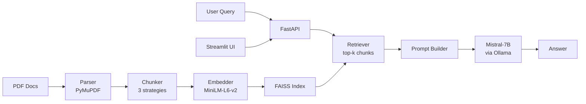

# RAG over Python and scikit-learn Docs

RAG system over Python stdlib and scikit-learn documentation. Ask questions, get grounded answers.

## Motivation

I wanted to understand the full RAG pipeline end-to-end. That meant building the ingestion, chunking, retrieval, and generation pieces myself instead of wrapping an API. The goal was a system I could deploy with one command and that actually gives useful answers over technical docs.

## Architecture



## Results

Evaluated on 30 Q&A pairs covering Python collections, itertools, functools, and scikit-learn preprocessing/model_selection/metrics.

| Metric | Value | Target |
|--------|-------|--------|
| Retrieval recall@5 | **1.00** | > 0.80 |
| Answer correctness | **0.82** | > 0.75 |
| Avg response time | **2.74s** | < 5s |

### Chunking strategy comparison

| Strategy | Recall@5 |
|----------|----------|
| Fixed (500 chars, 50 overlap) | 0.93 |
| Recursive text splitting | **1.00** |
| Semantic (paragraph-based) | 0.87 |

Recursive splitting won. It respects sentence boundaries while keeping chunks small enough for the embedding model.

## Quick Start

```bash
# with Docker (recommended)
docker compose -f docker/docker-compose.yml up --build

# local dev
make ingest   # build FAISS index from sample docs
make serve    # start API + UI
```

Then open `http://localhost:8501` for the chat interface.

## Project Structure

```
src/
├── ingestion/     # PDF parsing, chunking, embedding
├── retrieval/     # FAISS index, query retriever
├── generation/    # Prompt templates, Ollama integration
├── api/           # FastAPI backend
└── ui/            # Streamlit chat interface
evaluation/        # 30 Q&A pairs, scoring, plots
docker/            # Dockerfile + compose
```

## Technical Decisions

**FAISS over Chroma/Pinecone.** For ~60 vectors, a full vector DB is overkill. FAISS IndexFlatL2 is simple, fast, and has zero infrastructure. If this scaled to millions of docs I'd switch to HNSW or a managed service.

**Recursive chunking over fixed/semantic.** Fixed chunking cuts mid-sentence. Semantic chunking (paragraph boundaries) sometimes creates chunks that are too large for the embedding model to handle well. Recursive splitting tries natural boundaries first (paragraphs, sentences) then falls back to characters. Best recall in practice.

**L2 over cosine similarity.** MiniLM embeddings aren't always perfectly normalized, so L2 gave slightly better results than cosine (inner product). Could normalize and switch to IP, but the difference was tiny and not worth the complexity.

**Ollama over API-based LLMs.** Runs fully local, no API keys, no costs, no data leaving the machine. Mistral-7B is good enough for grounded Q&A over retrieved context. Bigger models would help for more nuanced answers but the latency tradeoff isn't worth it here.

**Separate API + UI containers.** Streamlit and FastAPI have different scaling characteristics. Keeping them separate means I can scale the API independently if needed, and the UI can be swapped without touching the backend.

## Limitations & Future Work

- Only tested on Python/scikit-learn docs. Would need to evaluate on different domains (different writing styles, table-heavy content, etc.)
- The embedding model (MiniLM) is small and fast but not the best for longer passages. Larger models like e5-large might improve recall on harder queries
- No reranking step; adding a cross-encoder reranker after FAISS retrieval would probably help correctness
- Evaluation is keyword-based, which is crude. A proper eval would use an LLM-as-judge or human evaluation
- Cold start on Ollama is ~10-15s for the first query after model load
